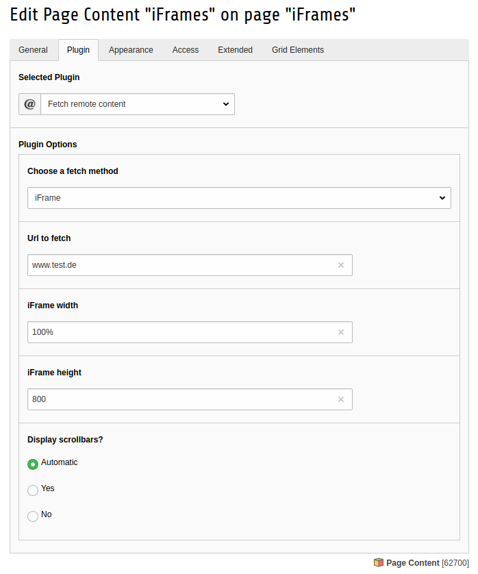
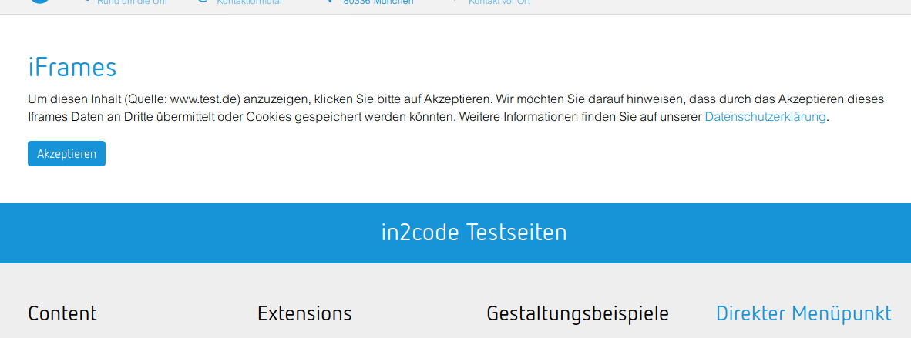

# TYPO3 extension fetchurl

## Introduction

Extension fetchurl for TYPO3. Basicly a fork for TYPO3 7, 8 and so on.

Fetch an url and show the content in Frontend.
Contained image or link URIs are rewritten accordingly.

## What's the difference to fetch_url from TER?

The editor can select if the content from another website should be grabbed as
static content (CURL) or via iFrame.

## Installation
* Installation is very simple - just install the extension then you can use the plugin

## How to overwrite HTML-Templates?

Just copy the folder Fetch in EXT:fetchurl/Resources/Private/Templates/ to any location and set the new path via 
TypoScript setup:

```
plugin.tx_fetchurl {
	view {
		templateRootPaths.1 = EXT:myextension/Resources/Private/Templates/Fetchurl/
	}
}
```


## Screenshots

Frontend example:


Plugin for editors in backend:


Example for a privacy save 2-click-solution:



## Changelog

| Version    | Date       | State      | Description                                                                  |
| ---------- | ---------- | ---------- | ---------------------------------------------------------------------------- |
| 4.0.0      | 2020-02-27 | Feature    | Add a 2-click solution for iframes                                           |
| 3.5.0      | 2019-07-29 | Task       | Use subtree split in composer for TYPO3 core                                 |
| 3.4.0      | 2017-02-18 | !!!Task    | Small refactoring, allow url without protocol                                |
| 3.3.1      | 2017-02-16 | Bugfix     | Show additional fields if plugin mode == iframe                              |
| 3.3.0      | 2017-02-01 | Feature    | Set iFrame width and scrollbars in FlexForm                                  |
| 3.2.0      | 2017-02-01 | Feature    | Set iFrame height in FlexForm                                                |
| 3.1.0      | 2016-12-22 | Task       | Remove refactor ext_tables.php for T3 8.5 and newer                          |
| 3.0.2      | 2016-12-02 | Bugfix     | Remove version from composer.json                                            |
| 3.0.1      | 2016-12-02 | Bugfix     | Hide not needed tt_content fields                                            |
| 3.0.0      | 2016-11-28 | Task       | Add iframe feature                                                           |
| 2.0.0      | 2016-05-23 | Initial    | Initial release of the fork of typo3-ter/fetch-url                           |
